# Unity Game Development Summary
| Field | Detail |
|---|---|
| **Project Name:** |**Dante's Journey**|
| **Names:**|**Matthew C, Jude L**|
| **Course/Class:**|**Computer Technology Yr10**|
| **Repository:**|**https://github.com/TempeHS/2026CT_GameDesign_DantesJourney_Matthew.C**|
| **Unity Version:** |**6000.0.58f1**|
| **Document Version:** | **1.0** |
| **Date:**|**27/8/2026** |

---

## Table of Contents
1. [Game Overview](#1-game-overview)
2. [Video Walkthrough](#2-video-walkthrough)
3. [Game Mechanics](#3-game-mechanics)
4. [Visual Features](#4-visual-features)
5. [Audio Design](#5-audio-design)
6. [User Interface & HUD](#6-user-interface--hud)
7. [Scene & Level Design](#7-scene--level-design)
8. [Scripts & Programming](#8-scripts--programming)
9. [Development Techniques & Tutorials Acknowledged](#9-development-techniques--tutorials-acknowledged)
10. [Third-Party Content Acknowledgements (NOT APPLICABLE)](#10-third-party-content-acknowledgements)
11. [Challenges & Solutions](#11-challenges--solutions)
12. [Branch Development Summary (NOT APPLICABLE)](#12-branch-development-summary)

---

## 1. Game Overview

### 1.1 Genre
2D Platformer

### 1.2 Target Audience
Teens

### 1.3 Game Summary
Dante's Journey is a 2D Platformer about travelling through the 9 circles of hell from Dante's Inferno. There are obstacles like moving saws trying to stop you from continuing forward, jump past them and dive deeper into hell.

### 1.4 Win / Loss Conditions
| Condition | Description |
|---|---|
| Win | Reach end of circle (level) |
| Loss | Lose all 3 hearts |

### 1.5 Platform & Build Settings
| Setting | Detail |
|---|---|
| Target Platform | PC |
| Resolution | 1920 x 1080 |
| Build Type | Windows 64-bit |

---

## 2. Video Walkthrough

### 2.1 Full Gameplay Walkthrough

<!--
  Embed a YouTube/Vimeo video or link to a file in the repository.
  YouTube embed syntax:
  

  OR link to a local file:
  [Watch Walkthrough Video](./docs/video/walkthrough.mp4)
-->

| Field | Detail |
|---|---|
| **Video Title** | Dante's Journey: Main Menu + Circle 1 |
| **Link / Embed** |[Dante's Journey: Main Menu + Circle 1 Showcase](DanteSS/Dante's_Journey_Showcase.mp4) |
| **Duration** | 1:59 |
| **Description** |Showcases main features of Dante's Journey, including menus, obstacles and visual features |

### 2.2 Feature Highlight Clips

| Clip | Description | Link |
|---|---|---|
|Healing Showcase |Showcasing damage and healing |[Healing](DanteSS/HealingShowcase.mp4)  |
|Moving Saws |Showcases vertical and horizontal moving saws |[Saws](DanteSS/UDLRMovingSaws.mp4) |
|Moving Spikes |Showcases moving spikes |[Spike](DanteSS/UDMovingSpike.mp4)  |
|Respawn |Showcases death animation and respawn |[Respawn](DanteSS/RespawnShowcase.mp4) |
|Pause Menu |Showcases pause button, buttons in the menu, music pausing. |[Respawn](DanteSS/PauseMenuShowcase.mp4) |

---

## 3. Game Mechanics

### 3.1 Core Mechanics
| ID | Mechanic | Description | Implemented In (Script / Objects) |
|---|---|---|---|
| M-1 | Damage | Allows obstacles to move and damage the player | EnemyObstacle.cs / Saws and Spikes| 
| M-2 |Health| Gives player health and shows amount of health | Health.cs and HealthBar.cs |
| M-3 |Player Movement| Lets player jump and walk | PlayerMovement.cs |
| M-4 | Healing | Lets player heal damage | HealthHealing.cs |
| M-5 | Music and SFX | Lets music and SFX play in the game | AudioManager.cs |

### 3.2 Player Controls
| Action | Input (Keyboard / Controller) | Description |
|---|---|---|
| Jump | Space | Lets the player jump, holding down increases jump height |
| Walk Left | A or Left Arrow | Lets the player walk to the left |
| Walk Right | D or Right Arrow | Lets the player walk to the right |
|  |  |  |

### 3.3 Physics & Collision
| Feature | Description |
|---|---|
| Player | Player interaction with objects, player ground check for jump |
| Saws and Spikes | Moves left, right, up and down (Saw), uses circle collider with isTrigger on to deal damage on collide with player (Both)|
| Heart (In Stage) | Uses box collider with isTrigger on to heal on collide with player |

### 3.4 Game Loop 
| Stage | Description |
|---|---|
| Start / Initialisation | Main Menu Play Button |
| Core Loop | Platform through level |
| Win / End State | Beat Level |
| Restart | Death or Restart in Pause Menu |

### 3.5 Scoring & Progression [Not Applicable in this Project]
| Element | Description |
|---|---|
| Scoring System |  |
| Difficulty Progression |  |
| Unlockables / Levels | |

---

## 4. Visual Features

### 4.1 Particle Effects [Not Applicable in this Project]

| Effect Name | Purpose | Screenshot |
|---|---|---|
| | | |
| | | |
| | | |
| | | |

---

### 4.2 Cut Scenes & Cinematics [Not Applicable in this Project]

| Cut Scene | Trigger | Description | Screenshot / Still |
|---|---|---|---|
| | | | |
| | | | |
| | | | |

---

### 4.3 Animations

| Animation | Object / Character | Description | Screenshot |
|---|---|---|---|
|Player Walking| Player | Player sprite walks |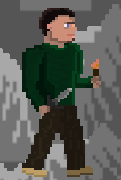 |
|Sawblade Active|Saw|Saw spins around clockwise |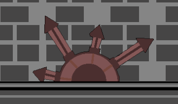 |
|Player Death | Player | Player falls to his knees and burns |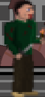 |
|Player Hurt | Player|Player flashes shades of red|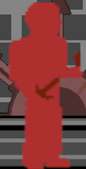|

---

### 4.4 Lighting & Post-Processing [Not Applicable in this Project]

| Feature | Description | Screenshot |
|---|---|---|
| | | |
| | | |
| | | |

---

### 4.5 Shaders & Materials [Not Applicable in this Project]

| Shader / Material | Applied To | Description | Screenshot |
|---|---|---|---|
| | | | |
| | | | |
| | | | |

---

### 4.6 Additional Visual Screenshots

| Description | Screenshot |
|---|---|
|Trees |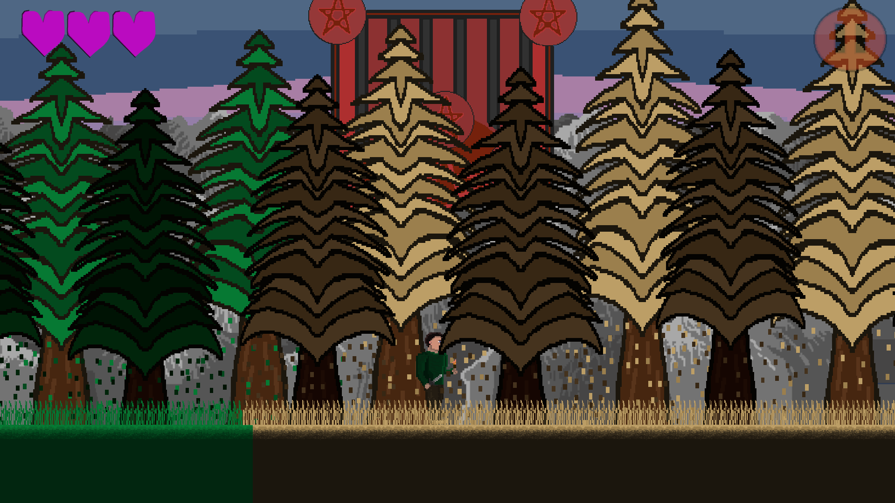 |
|Limbo Title |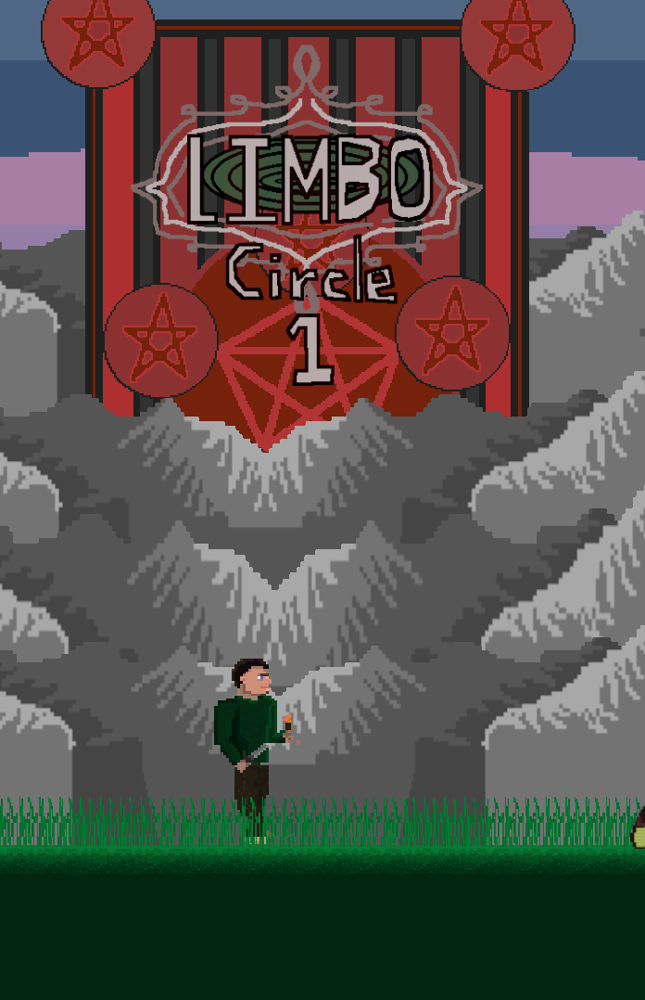 |
|Piston |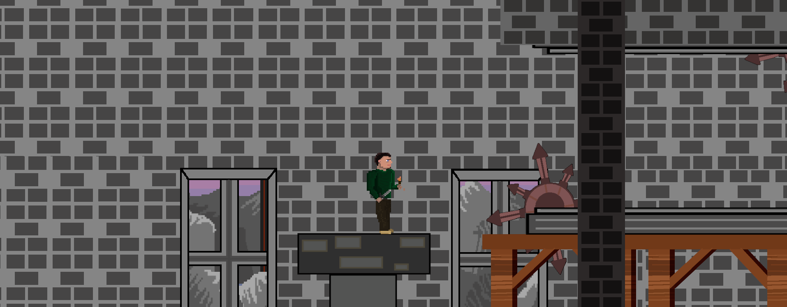 |
|Path of Suffering|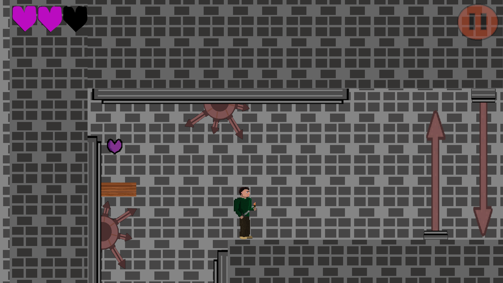 |
|Healing Object |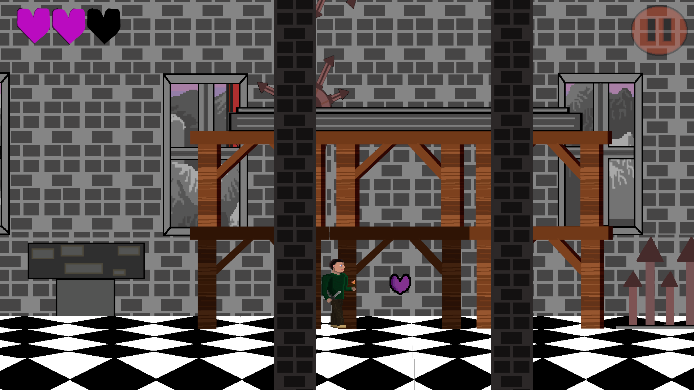 |

---

## 5. Audio Design

### 5.1 Music
| Track | Scene / Trigger | Source / Composer |
|---|---|---|
| Title Screen | Main Menu | Jude L. |
| Limbo | Limbo | Jude L. |

### 5.2 Sound Effects
| Sound Effect | Trigger | Source |
|---|---|---|
|Jump| Press space (Jump button) | Jude L.|
|Heal/Pick Up Item|Player collides with pick up object (healing item) | Jude L. |
|Walk| UNUSED | Jude L. |

### 5.3 Audio Implementation [Not Applicable In Project]
| Feature | Description |
|---|---|
| Audio Mixer / Groups | |
| Spatial / 3D Audio | |
| Dynamic Audio | |

---

## 6. User Interface & HUD

### 6.1 HUD Elements
| Element | Purpose | Screenshot |
|---|---|---|
|Health Bar |Show player's current health | |
---

### 6.2 Menus
| Menu | Purpose | Screenshot |
|---|---|---|
| Main Menu | Settings, Play, Quit Game |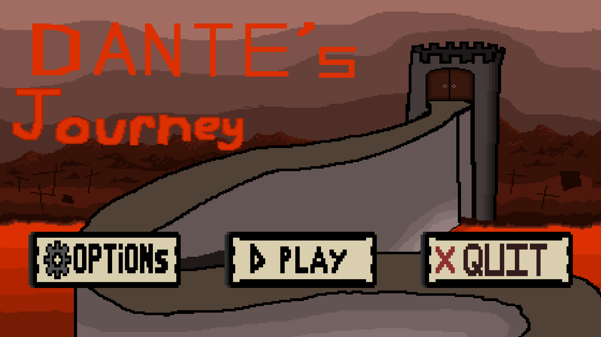 |
| Pause Menu | Return to main menu, resume level, restart level |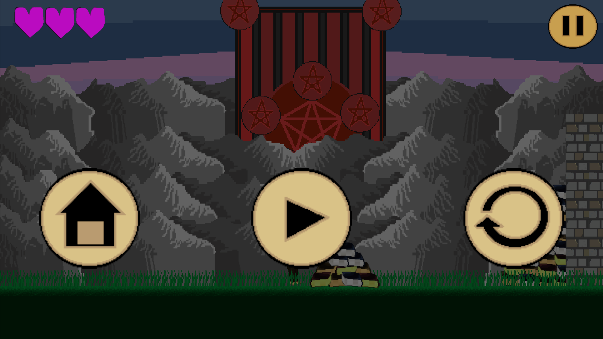 |
| Settings | No Current Purpose (sound button doesn't work) |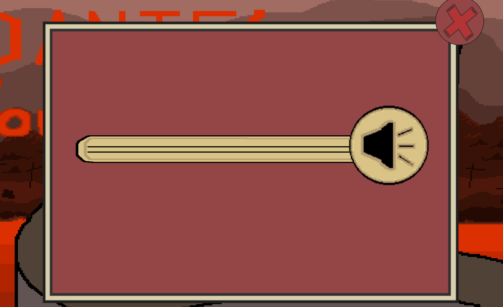 |

---

## 7. Scene & Level Design

### 7.1 Scene List
| Scene Name | Purpose | Description |
|---|---|---|
| Limbo| Gameplay area of circle 1 | Begins with piles of books as tutorial to jump, enters castle area to introduce damage and healing |
| Main Menu| Allow player to change settings, quit game and begin game | Name of game and background image, button for settings, playing and quitting the game |

### 7.2 Level / Environment Screenshots
| Level / Area | Description | Screenshot |
|---|---|---|
| Limbo (Circle 1) | Begins with green grass area with books and ruined pillars, enters castle with saw and spike traps |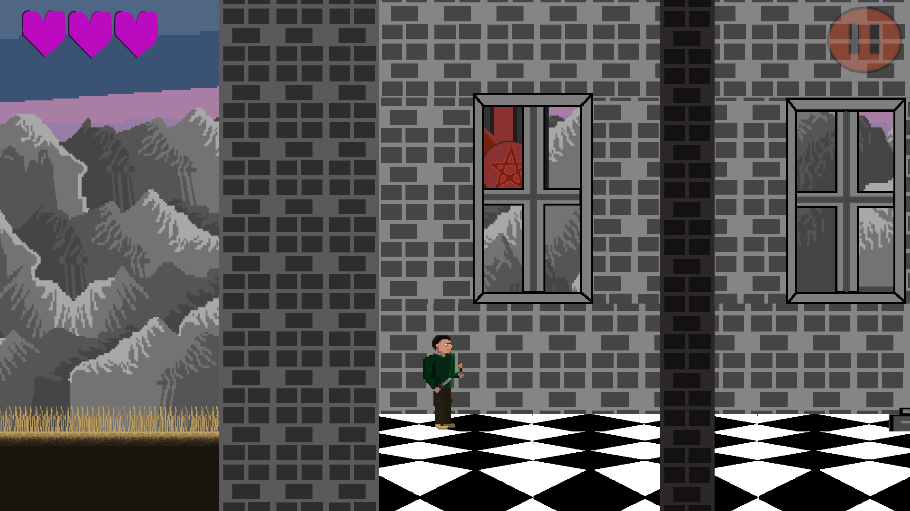 |

### 7.3 Scene Management
| Feature | Description |
|---|---|
| Scene Loading Method | LoadSceneAsync, GetActiveScene().buildIndex |
| Persistent Data Between Scenes | NOT APPLICABLE |
| Scene Transition Effects | NONE |

---

## 8. Scripts & Programming

### 8.1 Script Summary
| Script Name | Attached To | Responsibility |
|---|---|---|
| AudioManager.cs | Object: Audio Manager / Scripts: HealthHealing.cs, StartMenu.cs, PlayerMovement.cs | Allow audio to be used when certain events happen (e.g. Space button is pressed) | 
| EnemyObstacle.cs / EnemyObstacleVertical.cs | Object: Saw, Spike / Scripts: Health |Lets obstacles move, damages player when colliding with damaging object | 
| Parallax.cs + ParallaxController.cs |Object: Background Objects| Makes background have parallax effect |
|StartMenu.cs|Scripts: AudioManager.cs|Main Menu for player to start, lets player enter stage, quit game and change settings| 
|PauseMenu.cs|Objects: Pause Menu, Pause button, Resume,Home,Restart buttons |Lets the player pause the game with the pause button, restart the level, resume the level and return to the main menu using buttons inside the pause menu| 
|Health.cs, HealthBar.cs, HealthHealing.cs|Object: Health Bar, Player, Healing Object / Scripts: Player|Adds health system to player, lets current health be displayed, lets player heal damage|

### 8.2 Key Algorithms / Logic
| Feature | Script | Description |
|---|---|---|
|Death |Health.cs|If current health is higher than 0 the player is hurt, otherwise it triggers the death animation, stops player movement and respawns the player after 6 seconds|
|Saw Movement | EnemyObstacle.cs (x) / EnemyObstacleVertical.cs (y) |If `(x or y)` position is larger than `(left or top)` edge begin moving other way. If (x or y) is smaller than `(right or bottom)` edge begin moving back other way.|
| Healing| HealthHealing.cs | If an object with the tag 'Player' collides with the healing object, the script goes to the Health.cs script and adds value to the player's health, it then plays the heal sound effect and causes the healing object to dissapear |

---

## 9. Development Techniques & Tutorials Acknowledged

| # | Title | Author / Creator | URL / Source | What You Used It For | What You Changed / Adapted |
|---|---|---|---|---|---|
| 1 | 2D Player Movement In Unity | bendux | https://www.youtube.com/watch?v=K1xZ-rycYY8|Player Movement, jump | MINIMAL CHANGE |
| 2 | Make Your MAIN MENU Quickly!  Unity UI Tutorial For Beginners | Rehope Games|https://www.youtube.com/watch?v=DX7HyN7oJjE | Main Menu buttons |Used canvas for background to make main menu fit different resolutions|
| 3 |Unity 2D Camera Follow System |Rehope Games | https://www.youtube.com/watch?v=6p-VrQOj2KU|Camera following player | MINIMAL CHANGE |
| 4 |How to Create a PAUSE MENU in Unity !  UI Design Tutorial |Rehope Games |https://www.youtube.com/watch?v=MNUYe0PWNNs |Pause Button, pause menu, pause buttons | MININMAL CHANGE |
| 5 |How to Add MUSIC and SOUND EFFECTS to a Game in Unity  Unity 2D Platformer Tutorial #16 | Rehope Games|https://www.youtube.com/watch?v=N8whM1GjH4w |Adding music and sound effects on scene enter and event trigger | MINIMAL CHANGE |
| 6 |Unity 2D PARALLAX EFFECT Tutorial  Endless Scrolling Background |Rehope Games |https://www.youtube.com/watch?v=ZYZfKbLxoHI |Parallax effect for background| MINIMAL CHANGE |
| 7 |Unity 2D Platformer for Complete Beginners - #7 HEALTH SYSTEM | Pandemonium|https://www.youtube.com/watch?v=yxzg8jswZ8A |Health system (Health and Healthbar) and damage system| Added another script to allow for vertically moving obstacles |
---

## 10. Third-Party Content Acknowledgements [Not Applicable in this Project]

### 10.1 Visual Assets
| Asset Name | Type | Creator / Source | Licence | URL | Used For |
|---|---|---|---|---|---|
| | | | | | |
| | | | | | |
| | | | | | |

### 10.2 Audio Assets
| Asset Name | Type | Creator / Source | Licence | URL | Used For |
|---|---|---|---|---|---|
| | | | | | |
| | | | | | |
| | | | | | |

### 10.3 Scripts & Code Snippets
| Script / Snippet | Source | Licence | URL | Used For | Changes Made |
|---|---|---|---|---|---|
| | | | | | |
| | | | | | |
| | | | | | |

### 10.4 Unity Packages & Plugins
| Package Name | Version | Source | Licence | URL | Purpose |
|---|---|---|---|---|---|
| | | | | | |
| | | | | | |
| | | | | | |

### 10.5 Fonts
| Font Name | Creator / Source | Licence | URL |
|---|---|---|---|
| | | | |
| | | | |

---

## 11. Challenges & Solutions

| # | Challenge Encountered | How It Was Solved |
|---|---|---|
| 1 |Needed saws to move upward but they moved diagonally|In the code for EnemyObstacleVertical.cs, the order used was (y,x,z) due to swapping around the equation used to track the location of the saw and the fix was (x,y,z) |
| 2 |Walk SFX played for too long |Removed it from the game |
| 3 |Player continued moving after death |Implemented rigidbody lines to stop velocity and used GetComponent to disable PlayerMovement by input |
| 4 |Player did not respawn after death |Used WaitForSeconds and IEnumerator to delay respawn to allow for death animation to play|
| 5 |Colliders did not work for spikes|Accidently used 3D colliders rather than 2D Colliders, instead used circle colliders that the saws used |

---

## 12. Branch Development Summary

### Branch 1 — `main`

| Field | Detail |
|---|---|
| **Branch Name** | [`main`](https://github.com/TempeHS/2026CT_GameDesign_DantesJourney_Matthew.C) |
| **Purpose** | Stable, releasable version of the game |
| **Merged From** | [`main`](https://github.com/TempeHS/2026CT_GameDesign_DantesJourney_Matthew.C) |
| **Final Commit** | 21/9/2026 |

#### What Was Built
---
Everything was built in the main branch, I forgot to use any branches.
Features built include saws, health, damage, moving objects

#### Key Commits
| Commit Message | What Changed |
|---|---|
|UPD: Respawn, vertical moving saws, title parallax, README update |Added features of respawning, added script to make saws move vertically instead of horizontally, added parallax effect to limbo title |
|WIP: Sawblade + Health and Damage System | Added damage system and health system |
|WIP: Audio Implementation | Added audio manager, sound effects and music |
---

#### Problems Encountered & Resolved
| Problem | Resolution |
|---|---|
|Spikes did not damage player|Changed colliders and used isTrigger |
|Player was able to spam jump to climb on walls | Fixed grounded check |

#### Screenshot / Evidence
| ||
|---|---|
|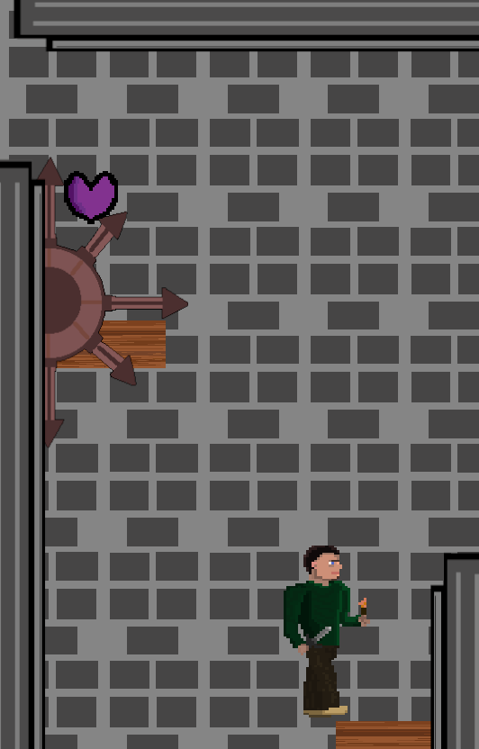|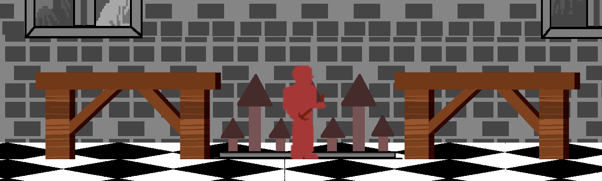|

---

### Branch Development Overview

| Branch Name | Feature | Date Started | Date Merged | Status |
|---|---|---|---|---|
| [`main`](https://github.com/TempeHS/2026CT_GameDesign_DantesJourney_Matthew.C) | Stable release |18/5/2026 |18/5/2026 | Working Features |

---

> **Student Declaration:** All work submitted is my own except where explicitly acknowledged above.
